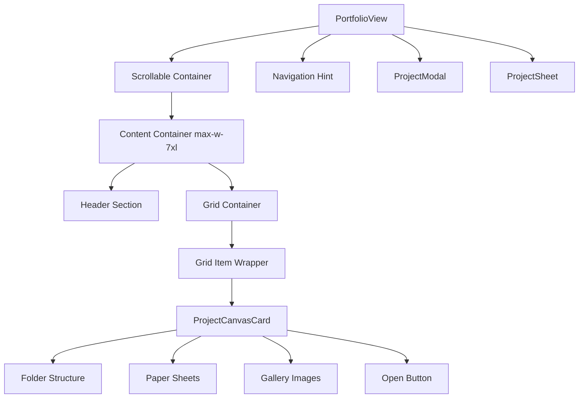
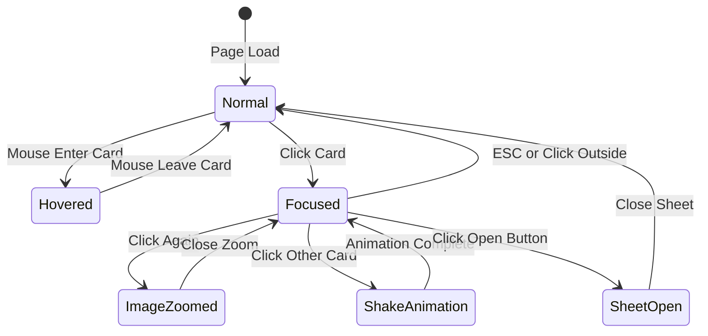
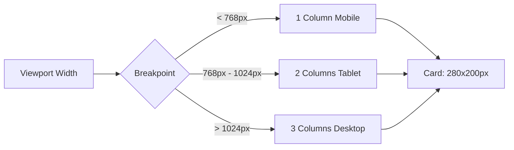
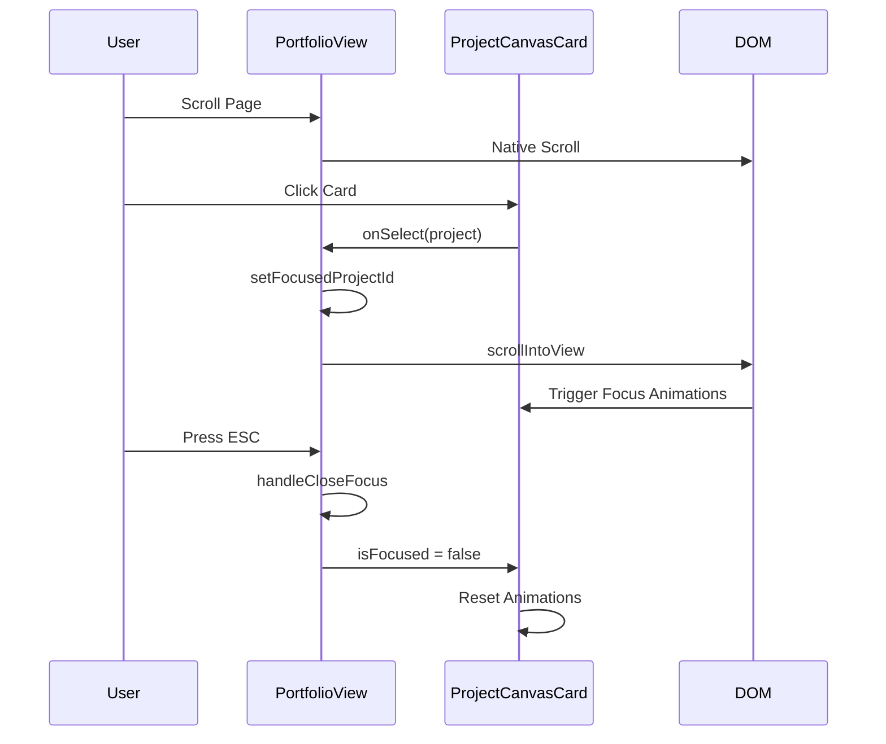

# Design Document

## Overview

This design transforms the portfolio from an infinite scrolling canvas with drag-to-pan navigation into a fixed, structured grid layout with standard vertical scrolling. The transformation maintains all existing interactive features (hover effects, focus states, project sheets, modals) while simplifying the navigation model and improving accessibility.

The design prioritizes:

- **Simplicity**: Standard web scrolling instead of custom canvas navigation
- **Structure**: Organized grid layout with consistent spacing
- **Elegance**: Clean typography and visual hierarchy
- **Maintainability**: Simplified data model without positioning coordinates
- **Accessibility**: Standard scrolling behavior and keyboard navigation

## Architecture

### Component Structure

```
PortfolioView (Main Container)
├── Header Section
│   ├── Title ("Portfolio")
│   └── Subtitle/Description
├── Grid Container
│   └── ProjectCanvasCard[] (Grid Items)
│       ├── Folder Structure
│       ├── Paper Sheets
│       ├── Gallery Images
│       └── Open Button (when focused)
├── Navigation Hint (Fixed Bottom)
├── ProjectModal (Overlay)
└── ProjectSheet (Slide-up)
```

### Layout System

**Container Hierarchy:**

```
<div> // Full viewport with gradient background
  <div> // Scrollable container (overflow-y-auto)
    <div> // Max-width container (max-w-7xl mx-auto px-8 py-12)
      <div> // Header section (text-center mb-16)
      <div> // Grid container (grid grid-cols-1 md:grid-cols-2 lg:grid-cols-3 gap-12)
        <div> // Grid item wrapper (w-full max-w-sm)
          <ProjectCanvasCard />
```

**Responsive Breakpoints:**

- Mobile (< 768px): 1 column
- Tablet (768px - 1024px): 2 columns
- Desktop (> 1024px): 3 columns

## Components and Interfaces

### 1. PortfolioView Component

**State Management:**

```typescript
// REMOVE: Canvas-related state
// - viewport: CanvasViewport (x, y, zoom)
// - viewportSize: { width, height }
// - dragInstance: Draggable instance
// - canvasRef, containerRef for dragging

// KEEP: Interaction state
- selectedProject: Project | null
- isModalOpen: boolean
- hoveredProjectId: string | null
- focusedProjectId: string | null
- isImageZoomed: boolean
- isSheetOpen: boolean
- sheetProject: Project | null
- hasAnimated: useRef<boolean> (for entrance animations)
```

**Removed Functionality:**

- `getConstrainedPosition()` - No longer needed
- `handleZoom()` - No zoom functionality
- `navigateToPosition()` - No canvas panning
- Draggable setup useEffect
- Wheel event listener for zoom
- Viewport size tracking

**Updated Functionality:**

```typescript
handleProjectSelect(project: Project) {
  if (focusedProjectId === project.id) {
    // Already focused - zoom to image
    setIsImageZoomed(true);
  } else if (focusedProjectId !== null) {
    // Another project focused - show shake feedback
    // User must unfocus first
    animateShake(focusedProjectId);
  } else {
    // Focus on project
    setFocusedProjectId(project.id);
    setIsImageZoomed(false);

    // Scroll to project card smoothly
    const projectCard = document.querySelector(`[data-project-card="${project.id}"]`);
    if (projectCard) {
      projectCard.scrollIntoView({
        behavior: 'smooth',
        block: 'center',
        inline: 'center'
      });
    }
  }
}
```

**Layout Structure:**

```tsx
<div className="w-screen h-screen overflow-hidden bg-gradient-to-br from-gray-50 to-gray-100">
  {/* Scrollable Container */}
  <div className="w-full h-full overflow-y-auto cursor-default">
    {/* Content Container */}
    <div className="max-w-7xl mx-auto px-8 py-12">
      {/* Header */}
      <div className="text-center mb-16">
        <h1 className="text-6xl font-serif font-light text-gray-800 tracking-wide mb-4">
          Portfolio
        </h1>
        <p className="text-xl text-gray-600 max-w-2xl mx-auto">
          A curated collection of my work, showcasing creativity and technical
          expertise
        </p>
      </div>

      {/* Projects Grid */}
      <div className="grid grid-cols-1 md:grid-cols-2 lg:grid-cols-3 gap-12 justify-items-center">
        {portfolioProjects.map((project, index) => (
          <div key={project.id} className="w-full max-w-sm">
            <ProjectCanvasCard
              project={project}
              scale={1} // Fixed scale, no zoom
              // ... other props
            />
          </div>
        ))}
      </div>
    </div>
  </div>

  {/* Navigation Hint */}
  <div className="fixed bottom-6 left-6">
    {/* Updated hints without drag/zoom */}
  </div>

  {/* Modals and Sheets */}
  <ProjectModal />
  <ProjectSheet />
</div>
```

### 2. ProjectCanvasCard Component

**Updated Props:**

```typescript
interface ProjectCanvasCardProps {
  project: Project;
  onSelect: (project: Project) => void;
  onImageZoom?: (project: Project) => void;
  onOpenProject?: (project: Project) => void;
  onHover?: (projectId: string | null) => void;
  scale: number; // Always 1 in new design
  isOtherHovered?: boolean;
  isFocused?: boolean;
  isOtherFocused?: boolean;
  isImageZoomed?: boolean;
  index: number;
}
```

**Style Changes:**

```typescript
// OLD: Absolute positioning with dynamic dimensions
const cardStyle = {
  position: "absolute" as const,
  left: project.x,
  top: project.y,
  width: project.width,
  height: project.height,
  transform: `scale(${scale})`,
  transformOrigin: "top left",
};

// NEW: Fixed dimensions, relative positioning
const cardStyle = {
  width: "280px",
  height: "200px",
  transform: `scale(${scale})`, // Always 1
  transformOrigin: "center",
};
```

**Behavior:**

- All existing animations remain (hover, focus, gallery)
- No changes to folder structure or visual design
- Scale prop always receives 1 (no zoom)
- Positioning handled by CSS Grid, not absolute coordinates

### 3. Data Model Updates

**Project Type:**

```typescript
// REMOVE from Project interface:
x: number;
y: number;
width: number;
height: number;

// KEEP all other properties:
export interface Project {
  id: string;
  title: string;
  description: string;
  imageUrl: string;
  category: string;
  technologies: string[];
  status: "completed" | "in-progress" | "concept";
  year: string;
  liveUrl?: string;
  githubUrl?: string;
  imageGallery?: string[];
}
```

**Portfolio Data:**

```typescript
// Remove positioning from all project objects
export const portfolioProjects: Project[] = [
  {
    id: "ai-analytics",
    title: "AI Analytics Dashboard",
    // ... other properties
    // REMOVE: x, y, width, height
  },
  // ... more projects
];

// Remove or deprecate canvasBounds
// No longer needed for layout calculations
```

### 4. Removed Components

**CanvasMinimap:**

- Component no longer rendered
- Can be kept in codebase for potential future use
- Import removed from PortfolioView

## Data Models

### Updated Project Interface

```typescript
export interface Project {
  id: string;
  title: string;
  description: string;
  imageUrl: string;
  category: string;
  technologies: string[];
  status: "completed" | "in-progress" | "concept";
  year: string;
  liveUrl?: string;
  githubUrl?: string;
  imageGallery?: string[];
}
```

### Removed Interfaces

```typescript
// CanvasViewport - no longer needed
// CanvasBounds - no longer needed for layout
```

## Error Handling

### Image Loading

**Existing behavior maintained:**

- Graceful fallback for failed image loads
- Loading states with opacity transitions
- Console warnings for debugging

### Focus State Conflicts

**Existing behavior maintained:**

- Shake animation when trying to focus while another project is focused
- ESC key to unfocus
- Click outside to unfocus

### Scroll Behavior

**New considerations:**

```typescript
// Ensure smooth scroll is supported
const projectCard = document.querySelector(
  `[data-project-card="${project.id}"]`
);
if (projectCard && "scrollIntoView" in projectCard) {
  projectCard.scrollIntoView({
    behavior: "smooth",
    block: "center",
    inline: "center",
  });
} else {
  // Fallback for older browsers
  projectCard?.scrollIntoView();
}
```

## Testing Strategy

### Visual Regression Testing

**Test Cases:**

1. Grid layout renders correctly on all breakpoints
2. Card spacing is consistent (gap-12)
3. Header typography and alignment
4. Navigation hints display correct text

### Interaction Testing

**Test Cases:**

1. Vertical scrolling works smoothly
2. Click to focus scrolls card into view
3. Hover effects work in grid layout
4. Focus state animations function correctly
5. Gallery images display in focused state
6. Project sheet opens correctly
7. Modal opens for image zoom
8. ESC key unfocuses project
9. Click outside unfocuses project

### Responsive Testing

**Breakpoints to test:**

1. Mobile (375px, 414px)
2. Tablet (768px, 1024px)
3. Desktop (1280px, 1440px, 1920px)

**Expected behavior:**

- 1 column on mobile
- 2 columns on tablet
- 3 columns on desktop
- Consistent card sizes across breakpoints
- Proper spacing maintained

### Performance Testing

**Metrics to verify:**

1. Initial render time (should improve without canvas calculations)
2. Scroll performance (should be native browser scrolling)
3. Animation frame rate during hover/focus
4. Memory usage (should decrease without Draggable instances)

### Accessibility Testing

**Test Cases:**

1. Keyboard navigation (Tab, Enter, ESC)
2. Screen reader compatibility
3. Focus indicators visible
4. Semantic HTML structure
5. ARIA labels where appropriate

## Migration Notes

### Breaking Changes

1. **Project data structure**: Remove x, y, width, height from all project objects
2. **Component props**: ProjectCanvasCard no longer uses absolute positioning
3. **Removed components**: CanvasMinimap no longer rendered

### Non-Breaking Changes

1. All interactive features maintained
2. Visual design of cards unchanged
3. Animation system preserved
4. Modal and sheet functionality unchanged

### Rollback Plan

If issues arise:

1. Revert type changes to Project interface
2. Restore positioning data in portfolio-data.ts
3. Restore canvas-based layout in PortfolioView
4. Re-enable Draggable and zoom functionality
5. Restore minimap component

## Design Decisions

### Why Remove Canvas Navigation?

**Rationale:**

1. **Accessibility**: Standard scrolling is more accessible than custom drag interactions
2. **Familiarity**: Users expect vertical scrolling on web pages
3. **Simplicity**: Reduces code complexity and maintenance burden
4. **Performance**: Native scrolling is optimized by browsers
5. **Mobile**: Touch scrolling works better than drag-to-pan on mobile devices

### Why Use CSS Grid?

**Rationale:**

1. **Responsive**: Built-in responsive behavior with media queries
2. **Consistent**: Automatic spacing and alignment
3. **Maintainable**: Easy to adjust layout without touching positioning logic
4. **Accessible**: Proper document flow for screen readers
5. **Standard**: Well-supported across all modern browsers

### Why Keep Card Animations?

**Rationale:**

1. **Visual Interest**: Animations add polish and engagement
2. **Feedback**: Hover and focus states provide clear interaction feedback
3. **Brand**: Unique folder-style design is a differentiator
4. **Tested**: Existing animations are proven and debugged

### Why Fixed Card Sizes?

**Rationale:**

1. **Consistency**: Uniform grid looks more professional
2. **Predictability**: Users know what to expect
3. **Simplicity**: No need to calculate dynamic sizes
4. **Performance**: Fixed sizes are easier for browser to optimize

## Visual Design

### Typography

**Header:**

- Title: `text-6xl font-serif font-light text-gray-800 tracking-wide`
- Subtitle: `text-xl text-gray-600`

**Card Title:**

- `font-serif text-lg font-semibold text-gray-800`

### Spacing

**Container:**

- Max width: `max-w-7xl` (80rem / 1280px)
- Horizontal padding: `px-8` (2rem)
- Vertical padding: `py-12` (3rem)

**Header:**

- Bottom margin: `mb-16` (4rem)

**Grid:**

- Gap: `gap-12` (3rem)

**Card:**

- Max width: `max-w-sm` (24rem / 384px)
- Fixed dimensions: 280px × 200px

### Colors

**Background:**

- Gradient: `from-gray-50 to-gray-100`

**Cards:**

- Folder: `bg-gray-50 border-gray-300`
- Papers: `bg-white border-gray-300`

**Text:**

- Primary: `text-gray-800`
- Secondary: `text-gray-600`

### Shadows

**Cards:**

- Folder: `0 6px 20px rgba(0,0,0,0.08), 0 2px 6px rgba(0,0,0,0.04)`
- Papers: `0 ${2 + index}px ${8 + index * 2}px rgba(0,0,0,0.06)`

## Implementation Phases

### Phase 1: Layout Transformation

1. Update PortfolioView component structure
2. Replace canvas container with scrollable grid
3. Add header section
4. Update navigation hints

### Phase 2: Data Model Updates

1. Update Project type definition
2. Remove positioning from portfolio data
3. Update ProjectCanvasCard styling

### Phase 3: Interaction Updates

1. Update handleProjectSelect for scroll behavior
2. Remove zoom and drag functionality
3. Remove minimap rendering
4. Test focus and unfocus behavior

### Phase 4: Testing & Polish

1. Test responsive behavior
2. Verify all animations work
3. Test keyboard navigation
4. Performance testing
5. Accessibility audit

## Mermaid Diagrams

### Component Hierarchy



### Interaction Flow



### Responsive Layout



### Data Flow


